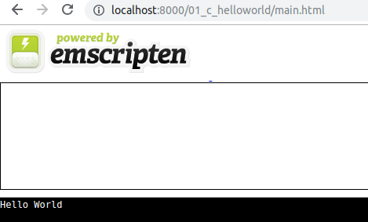

# Docker Emscripten

# C > JavaScript

```
make build_01
```

# C++ > C > JavaScript

```
make build_02
```

# Server

```
emrun --port 8000 .
```

Open

http://localhost:8000/01_c_helloworld/main.html

# Output



# References

* [C to wasm](https://developer.mozilla.org/en-US/docs/WebAssembly/C_to_wasm)

* [Installing Emscripten](https://webassembly.org/getting-started/developers-guide/)