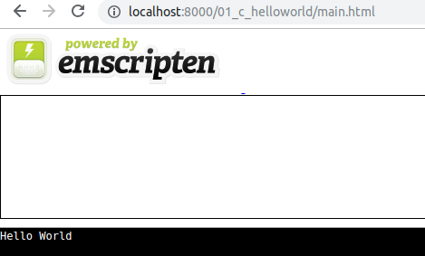
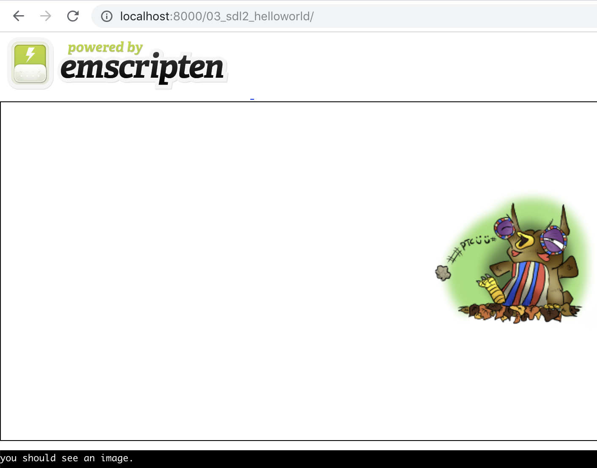

# Docker Emscripten

# PreRequirements

* Make


# C > JavaScript

```
make build_01
```

# C++ > C > JavaScript

```
make build_02
```
# C + SDL > JavaScript

```
make build_03
```


# C + SDL2 > JavaScript

```
make build_04
```


# Server

```
make docker_emrun
```

Open

http://localhost:8000/01_c_helloworld





http://localhost:8000/03_sdl2_helloworld/




# References

* [C to wasm](https://developer.mozilla.org/en-US/docs/WebAssembly/C_to_wasm)

* [Installing Emscripten](https://webassembly.org/getting-started/developers-guide/)

* [SDL2 to wasm](https://lyceum-allotments.github.io/2016/06/emscripten-and-sdl2-tutorial-part-4-look-owl)